# Keeper Machine - Hack The Box

- Target IP Address: `10.10.11.227`

- Kiểm tra kết nối: `ping -c 2 10.10.11.227`

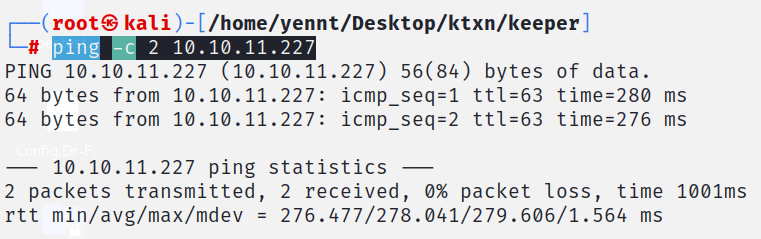

## Enumeration

- sử dụng `nmap` để quét các cổng dịch vụ đang chạy: `nmap -sC -sV 10.10.11.227 -oA nmap.out`

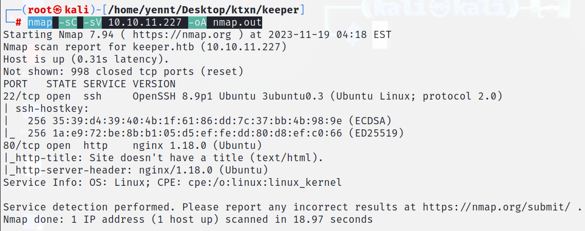

    --> Target mở port `22/open`, `80/open`

- Truy cập với địa chỉ `http://10.10.11.227`, ta nhận được link mới `tickets.keeper.htb`

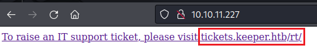

- Tuy nhiên trang web này không thể truy cập được, ta sẽ giải quyết nó bằng cách thêm vào `/etc/hosts`

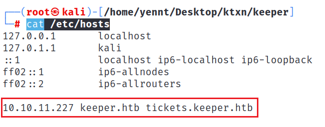

- Truy cập thành công, ta sẽ thấy trang `login`

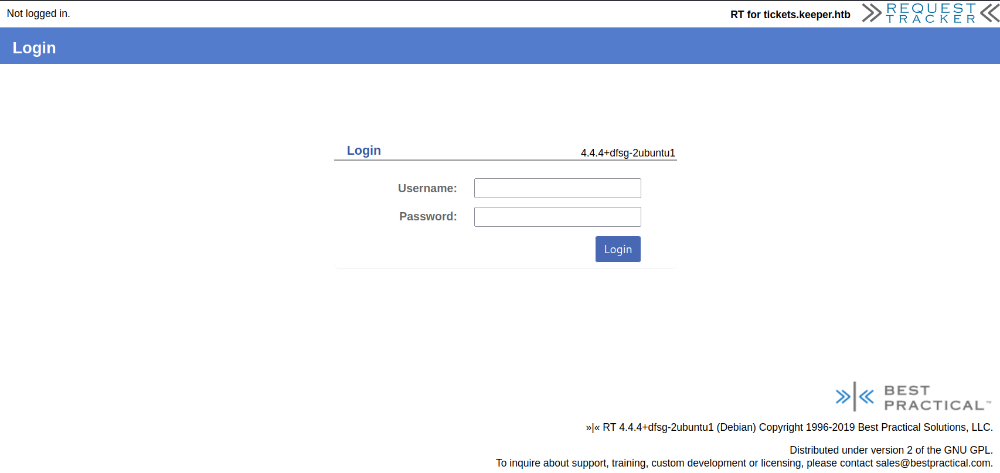

- Tuy nhiên ta không có tài khoản để đăng nhập, và cũng không thấy chức năng đăng ký tài khoản, ta sẽ đi tìm tài khoản đăng nhập.

## Initial Access

- Phát hiện trang web sử dụng `RT 4.4.4+dfsg-2ubuntu1 (Debian) Copyright 1996-2019 Best Practical Solutions, LLC`, tìm kiếm một hồi trên google, ta phát hiện có tài khoản mặc định `root:password`

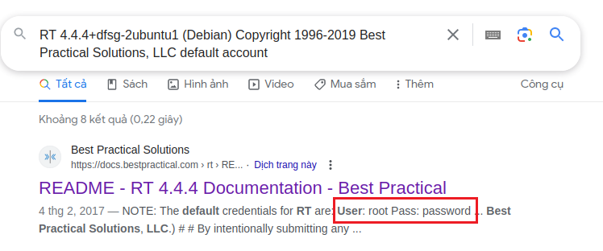

- Đăng nhập thành công, tìm một hồi các chức năng, ta phát hiện người dùng `lnorgaard` và email `lnorgaard@keeper.htb`

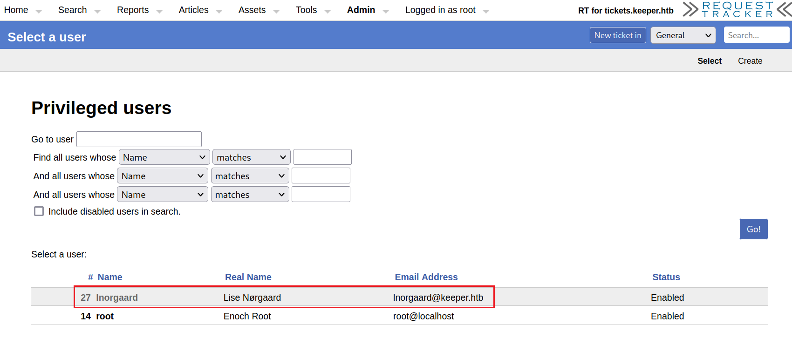

- Xem chi tiết thì ta thu thập thêm được thông tin về người dùng này như, `Language: Danish`, và đặc biệt là mật khẩu của tài khoản `Welcome2023!`

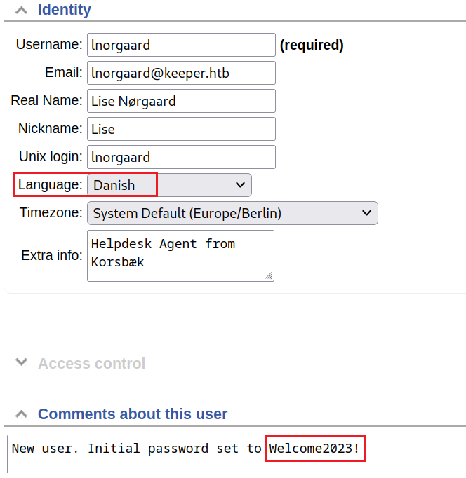

- Thực hiện `ssh` đối với tài khoản này ta thấy file `user.txt` --> Tìm thấy `User Flag`

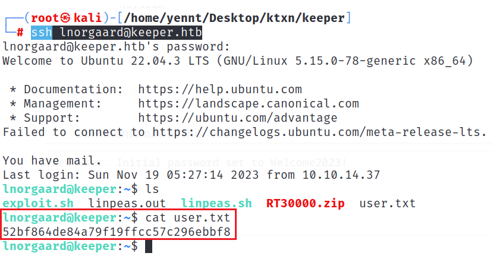

## Privilege Escalation

- Kiểm tra quyền `sudo` --> không thể sử dụng

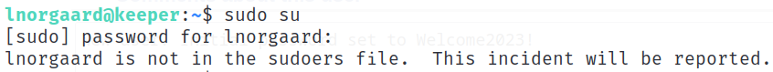

- Ngoài `user.txt`, ta còn thấy có tệp zip `RT30000.zip`, giải nén ta được 2 file mới

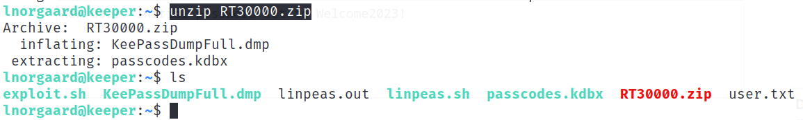

- Kiểm tra tệp:

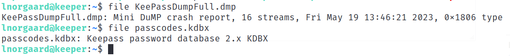

- Do không thể dùng quyền `sudo`, nên ta sẽ tải 2 file này về máy của mình để chuẩn bị khai thác: `scp lnorgaard@keeper.htb:/home/lnorgaard/RT30000.zip ./`

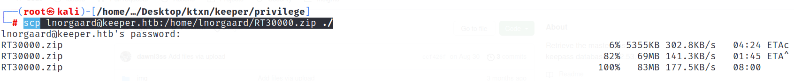

- Phát hiện sử dụng phiên bản `Keepass 2.0`, tìm kiếm thì phát hiện phiên bản này có lỗ hổng `CVE-2023-32784`

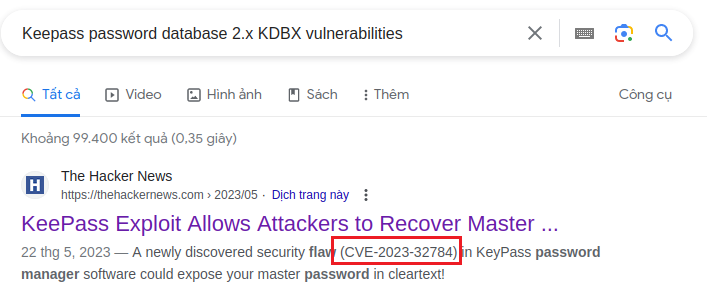

- Tìm kiếm cách khai thác: https://github.com/dawnl3ss/CVE-2023-32784

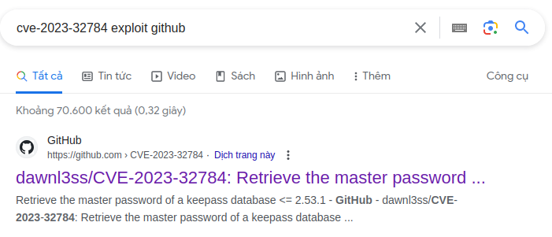

- Tiến hành khai thác: `python3 poc.py <PathToDmp>`

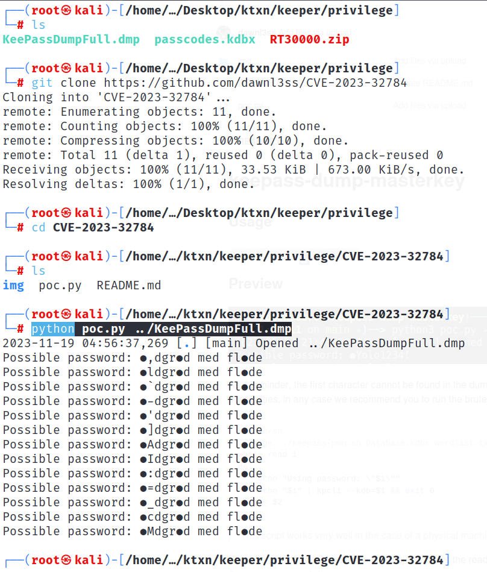

- Dựa vào Language ta đã tìm được là Danish, ta tìm thử thì nhận được chuỗi `rødgrød med fløde`

- Truy cập trang web của keepass, mở file `passcode.kdbx` với pass vừa tìm được

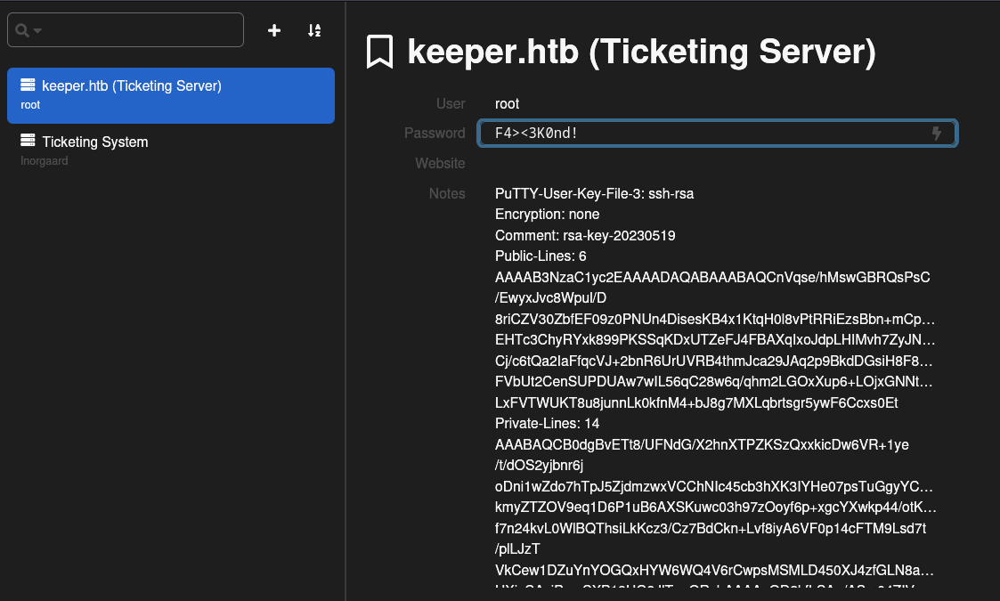

- Ta thấy có sử dụng `Putty`, ta sẽ dùng putty để lấy private key: `puttygen key.ppk -O private-openssh -o id_rsa`

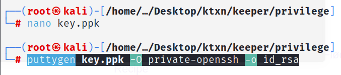

- Leo quyền thành công và lấy `Root Flag`: `ssh root@keeper.htb -i id_rsa`

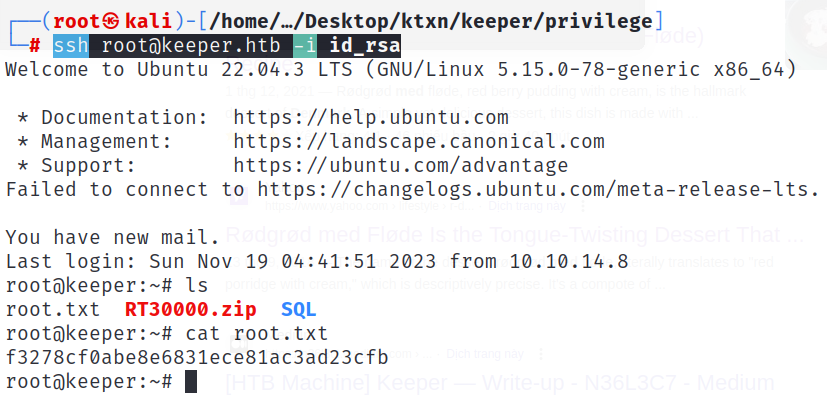