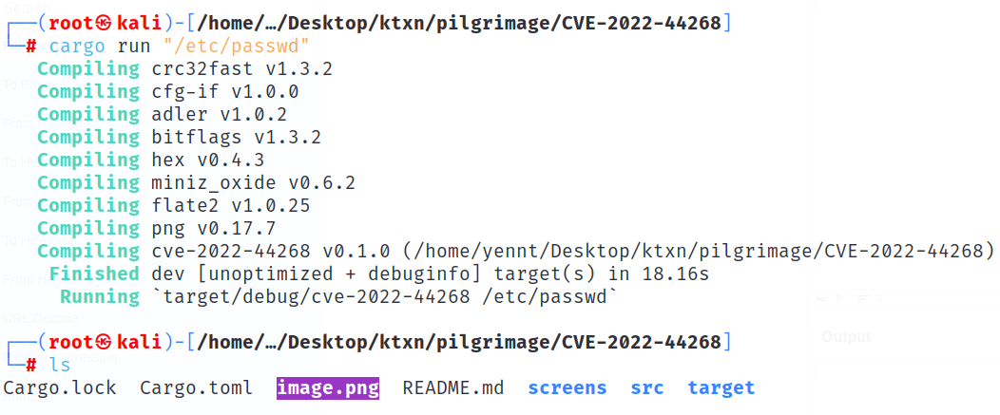

# [Pilgrimage Machine - Hack The Box](https://app.hackthebox.com/machines/Pilgrimage)

- Target IP Address: `10.10.11.219`

- Kiểm tra kết nối: `ping -c 2 10.10.11.219`

## Enumeration

- sử dụng `nmap` để quét các cổng dịch vụ đang chạy: `nmap -sC -sV 10.10.11.219 -oA nmap.out`

    --> Target mở port `22/open`, `80/open`

- Truy cập với địa chỉ `http://10.10.11.219`, sẽ redirect sang trang `pilgrimage.htb`, tuy nhiên trang web này không thể truy cập được, ta sẽ giải quyết nó bằng cách thêm vào `/etc/hosts`

- Truy cập thành công, ta sẽ thấy trang web

## Initial Access

- Ta chưa thấy thông tin gì để khai thác, sử dụng `dirsearch` ta phát hiện có thư mục `.git`

- Sử dụng [GitHack](../img/pilgrimage/) để tải source code từ `.git` về

- Ta phát hiện trong file `index.php` có sử dụng `magick binary` để xử lý hình ảnh: `exec("/var/www/pilgrimage.htb/magick convert /var/www/pilgrimage.htb/tmp/" . $upload->getName() . $mime . " -resize 50% /var/www/pilgrimage.htb/shrunk/" . $newname . $mime);`

- Phát hiện kiểu và phiên bản của `magick`

- Tìm kiếm thì ta phát hiện có lỗi `Arbitrary File Read`

    - https://www.exploit-db.com/exploits/51261

    - https://github.com/voidz0r/CVE-2022-44268

- Khai thác:

    

    - Tải `image.png` lên web để shrink và download file về `output.png`

    

    - Sử dụng `exiftool output.png` ta sẽ nhận được đoạn mã hex

    

    - Sử dụng [CyberChef](../img/pilgrimage/https://gchq.github.io/CyberChef/) để giải mã thì đây chính là nội dung của file `/etc/passwd`

    

- Ngoài ra trong `index.php`, ta thấy web sử dụng database `sqlite3` và được lưu trữ tại `/var/db/pilgrimage`.

- Khai thác tương tự như trên ta sẽ đọc được nội dung file này

- Download, sử dụng `sqlite` để mở file và ta sẽ đọc được thông tin về người dùng `emily:abigchonkyboi123`

- Thực hiện `ssh` đối với tài khoản này ta thấy file `user.txt` --> Tìm thấy `User Flag`

## Privilege Escalation

- Kiểm tra quyền `sudo` --> không thể sử dụng

- Sử dụng `ps -aux` để giám sát các quy trình linux, ta tìm thấy một quy trình đáng ngờ `/bin/bash /usr/sbin/malwarescan.sh`

- Đọc nội dung của file trên, ta thấy các tệp mới được tạo bằng `binwalk`, lưu trữ lại `/var/www/pilgrimage.htb/shrunk/` và tự động xóa các tệp phù hợp với tiêu chí xác định trong `blacklist`

- Phát hiện phiên bản của `binwalk`

- Tìm kiếm thì phát hiện phiên bản này có lỗi `RCE` có thể thực thi lỗi từ xa: https://www.exploit-db.com/exploits/51249

- Sử dụng code trong link trên lưu thành file `rce.py` để tiến hành khai thác ta sẽ được file `binwalk_exploit.png`, ở đây ta lựa chọn port `8000`

- Tạo server để `emily` có thể tải file độc hại vừa tạo

- Tải file và up lên đường dẫn binwalk tạo ở trên

- Lắng nghe ở cổng `8000`, ta thấy đã có connect, và đã khai thác `RCE` thành công --> lấy `Root Flag`

